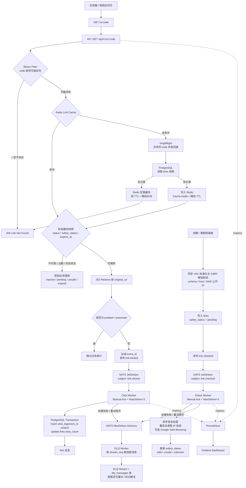

[toc]

# renice-sl (short link)

此项目为本人个人练手项目，旨在通过真实项目进行 Top-Down 式的学习，主要学习路线偏后端与基础前端和运维，技术栈为 **`Go 1.25` + `Gin` + `PostgreSQL` + `Redis` + `NATS JetStream` + `Next.js` + `Docker` + `Kubernetes`**，项目有使用 ai 给核心链路补上单元测试，并且有自己通过 docker compose 本地部署后，通过 wrk 进行压力测试得到实际数据 [benchmark.md](docs/benchmark.md)，**压测参数均为 8 线程 200 并发压测 60s**。

此项目包含认证、短链管理、302 重定向、异步点击统计、缓存防护、DLQ、监控与 Docker/Kubernetes 部署

此项目除了单元测试外，几乎所有的部分都是纯手写（但会让 ai 给出最小例子，跟项目上下文无关的，来辅助我学习），是为了在犯错中不仅学到会用，而是知道为什么要这样用以及为什么要这样设计

## 核心链路图



## 项目部署方式

本项目支持通过 Docker 以及 k8s 部署，并且支持 GitHub CI 与 GitHub Self-Runner/Argo CD 的 CD 方式，其中 Self-Runner 的 label 可以跟据自己的具体 label 修改 [docker.yml](.github/workflows/docker.yml)

### 通过 Docker 部署

在 `deploy/docker` 下执行

```bash
# 如果是生产环境，请记得修改具体配置项
# 如果需要使用 Google SafeBrowsing API，请配置你的 API Key
cp .env.example .env
docker compose up -d
```

### 通过 Kubernetes 部署

如果您不使用 Argo CD，在 `deploy/k8s` 下按顺序执行

```bash
cp base/infra/secret.yaml.example base/infra/secret.yaml
# 如果是生产环境，请记得修改具体配置项
# 如果需要使用 Google SafeBrowsing API，请配置你的 API Key
# 配置文件位于 base/infra/configmap.yaml 与 base/infra/secret.yaml
kubectl apply -f base/infra/namespace.yaml
kubectl apply -f base/infra/configmap.yaml
kubectl apply -f base/infra/secret.yaml
kubectl apply -f base/infra/nats.yaml
kubectl apply -f base/infra/redis.yaml
kubectl apply -f base/infra/postgres.yaml
# 等待 nats, redis, postgres 启动后
kubectl apply -f base/dev/migrate.yaml
# 等待 migrate job 完成后
kubectl apply -f base/dev/api.yaml
kubectl apply -f base/dev/web.yaml
kubectl apply -f base/dev/worker.yaml
# 如果需要 ingress 的话，请将 ingress 的域名修改为你的域名
kubectl apply -f base/dev/ingress.yaml
```

如果您使用 Argo CD，在 `deploy/k8s` 下按顺序执行

```bash
cp base/infra/secret.yaml.example base/infra/secret.yaml
# 如果是生产环境，请记得修改具体配置项
# 如果需要使用 Google SafeBrowsing API，请配置你的 API Key
# 配置文件位于 base/infra/configmap.yaml 与 base/infra/secret.yaml
kubectl apply -f base/infra/namespace.yaml
kubectl apply -f base/infra/secret.yaml

kubectl apply -f argo/renice-sl-infra.yaml
# 等待基础设施起来后
kubectl apply -f argo/renice-sl-dev.yaml
```

## 项目技术亮点（学到的点）

### 1. 缓存防御体系

* 设计了 **Cache-Aside 缓存体系**，在改/删操作后会删除 Redis 中的缓存版本，尽可能保证缓存一致性
* **缓存穿透：**最早没做任何防护时，访问固定不存在短链接时，wrk 测得 QPS 在 33906，访问随机不存在短链接时 QPS 为 32246；于是考虑加入**空值缓存**，访问固定不存在短链接时 QPS 增加到 38026，访问随机不存在短链接时 QPS 降到了 24398；于是考虑加入**布隆过滤器**，访问固定不存在短链接时 QPS 增加到 39005，访问随机不存在短链接时 QPS 增长到 40903。
  其中布隆过滤器为内存式实现，所以仅能单体部署，不能分布式部署
* **缓存击穿**：将缓存 TTL 设为 1s 的极端情况模拟缓存击穿，访问已有链接：QPS 为 35614，PG Calls 为 5171；加上 **singleflight** 后 QPS 降为 30101，PG Calls 降为 60（刚好 1min 60s，所以 60 次）。虽然 QPS 降低，但由于是极端情况，实际 QPS 不会降低多少，跟 PG 回源产生的性能损耗相比是能接受的
* **缓存雪崩**：设置**随机缓存 TTL** 解决。且很难获取具体压测数据所以没有进行压测

### 2. 限流

* **Redis Lua 令牌桶限流**：通过 Lua 脚本的原子性实现的限流操作（具体实现在 [limiter.go](server/shared/ratelimit/limiter.go)）
* **ip 限流**：通过在 middleware 内，用 ip 为 key，使用 Redis Lua 令牌桶限流的方式对注册，登录链路进行限流。同时也支持通过 UserID 进行限流

### 3. SSRF 防护与重定向链路检验

* **创建时同步校验**：通过 DNS 解析目标域名，结合 http 客户端对五跳内重定向的 ip 进行校验，拦截内网地址，云元数据地址，回环，CGNAT，link-local，multicast 等 ip，并且超过五跳的重定向链接不允许放行。
* **创建后异步校验**：若配置了 Google Safe Browsing API Key，则会通过 Google Safe Browsing API 检验网站是否为恶意网站，若是，则会更新状态为不可用

### 4. CI/CD 全链路

通过 **GitHub Actions**，在 Push main/PR 时跑前后端的编译测试与构建测试作为 CI；同时在 Tag main 时，通过 docker build 构建镜像并推送至 GHCR，并且可以通过 **GitHub Self-hosted Runner 完成 CD 链路**；也可以用 **ArgoCD + kubectl，通过 sync-wave 的形式实现 CD 链路**。

### 5. NATS JetStream

* **异步化**：在同步写 DB 时，**重定向接口 RPS 仅有 940，P50/P95/P99 约为 205ms/267ms/309ms**；引入 NATS JetStream 异步写 DB 后，**重定向接口 RPS 提升至 31859，P50/P95/P99 降至约 5ms/10ms/13ms**；。
* **幂等性**：每个点击事件会携带生成的 `event_id`（UUID），保证 NATS 消息重试不会产生重复统计
* **死信队列**：利用 NATS 原生的 Advisory 机制感知消费失败的信息，自动移入 DLQ，保证消息不丢且能反馈给管理员进行手动处理

### 6. 监控指标

通过 Docker 部署时，会部署上 `Prometheus` 和 `Grafana`，并且有 `Grafana Provision` 自动添加好 Dashboard 等，并在代码中已经埋好了 Prometheus 的监控指标，包括但不限于缓存命中率，DLQ 积压量，核心链路如重定向的请求数等

### 7. sql 调优

通过 date_trunc 统计日/周/月的用户新增量，链接新增量等数据，发现在 200w 级别的表中统计时间大约为 1.8-1.9s。通过 EXPLAIN ANALYZE 进行调优后优化至约 190ms
